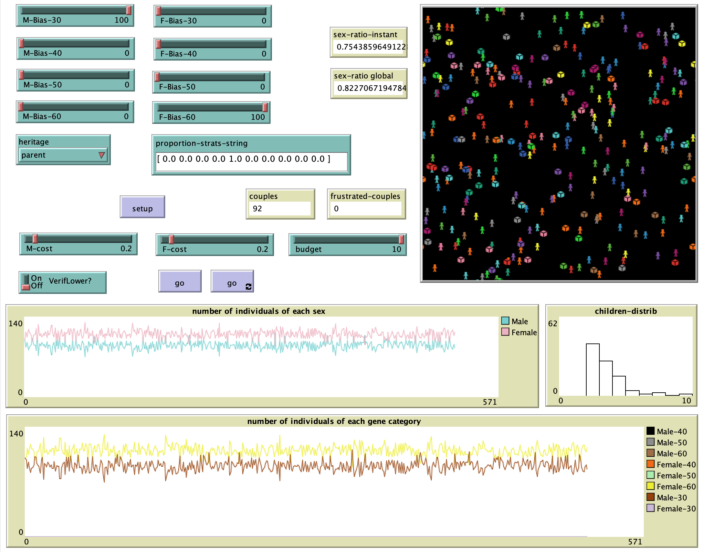

# sex-ratio
Agent based computational biology. One step further than (fisher 1930). 

## Abstract
Here we present a **virtual laboratory for studying sex-ratio**, exploring the tensions between Fisher's biological equilibrium and the strategic choices of agents. It simulates how genetic inheritance and cultural biases (eugenics, preferences) interact with finite resource constraints (budget/energy). The software reveals critical emerging properties, including the economic truncation threshold where collective survival collapses in the face of individual demands. By combining evolutionary biology and multi-agent systems, it offers a tool for predictive management of stochastic extinction risks.

In particular, it allows you to:
- Test the resilience of Fisher's equilibrium: Observe how the 50/50 parity ratio resists or collapses when faced with the introduction of genetic biases or massive cultural preferences.
- Simulate complex reproductive strategies: Model stopping rules (e.g., "stop after a son") and selection behaviours (eugenics) to analyse their impact on population structure.
- Analyse the impact of resource constraints: Measure the breaking point where the cost of raising offspring (parental investment) exhausts the available budget, causing premature cessation of the lineage.
- Compare modes of genetic transmission: Study the speed at which a trait spreads depending on whether it follows sex-linked inheritance or random mixing between parents.
- Identify emerging extinction scenarios: Detect "phase transitions" where the sum of rational individual choices leads, through a mass effect, to the total collapse of the system (tragedy of the commons).

  

## Operation

Le fichier ratio-sexuel.nlogo contient le code correspondant écrit en [Netlogo](https://ccl.northwestern.edu/netlogo/)
1. téléchargez le fichier (bouton Code (vert) puis "download ZIP")
2. allez sur https://netlogoweb.org/
3. cliquez sur "Run in your Browser" puis en haut à droite "parcourir"
4. chargez le fichier sauvegardé (ratio-sexuel.nlogo) 

## Commands

- `M-Bias-30`, `M-Bias-40`, `M-Bias-50`, `M-Bias-60` sont les curseurs permettant de régler la population de mâles au départ. `F-Bias-30` sont des mâles ayant une probabilité de donner naissance à un mâle de 30% (et donc de 70% de donner naissance à une femelle) lors d'une naissance.
- `F-Bias-30`, `F-Bias-40`, `F-Bias-50`, `F-Bias-60` sont les curseurs permettant de régler la population de femelles au départ. `F-Bias-30` sont des femelles ayant une probabilité de donner naissance à un mâle de 30% (et donc de 70% de donner naissance à une femelle) lors d'une naissance.
- `heritage` permet de choisir la méthode d'héritage génétique d'un nouvel enfant. `parent` affecte au nouveau né le biais de son parent de même sexe. `random` affecte au nouveau né soit le biais du père, soit le biais de la mère, aléatoirement. 
- `proportion-strats-string` est le vecteur indiquant la proportion de chaque stratégie lors de reproduction pour un nouveau couple. La stratégie est choisie aléatoirement dans ce vecteur. 10 stratégies sont possibles. Les 7 premières non eugénistes, les 3 dernières eugénistes. Il doit impérativement y avoir 10 valeurs et la somme doit faire 1.0
- `Setup` permet d'initialiser la simulation avec les paramètres ci-dessous
- `M-cost`, `F-cost`, `budget` sont les curseurs de contraintes budgétaires. {budget} est le montant affecté à chaque couple pour l'ensemble de ses naissances. {M-cost} et F-cost} sont respectivement les couts d'élevage d'un mâle et d'une femelle.
- `VerifLower?` est un switch qui permet, quand il est "on", d'avoir une popup qui s'affiche quand la population baisse sous la population initiale. C'est juste une information. En validant la popup, la simulation continue
- `Go` permet de lancer l'expérience. Soit en effectuant un tick de simulation, soit en la faisant tourner indéfiniment 
